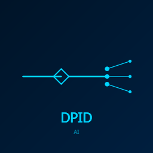
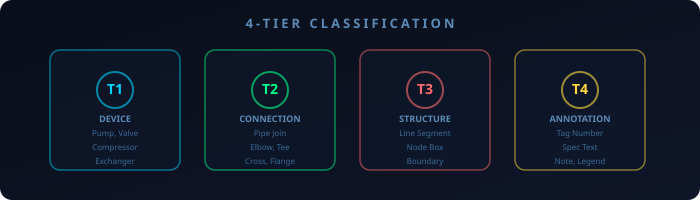
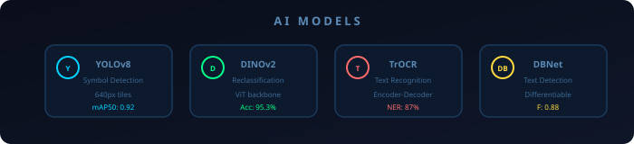

<div align="center">



# DPID AI

### Universal Industrial P&ID Digitization Suite

**Automatically detect, classify, and extract symbols from Piping & Instrumentation Diagrams**

[](https://python.org)
[](https://pytorch.org)
[](https://ultralytics.com)
[](https://github.com/facebookresearch/dinov2)
[](LICENSE)

---

[**Quick Start**](#-quick-start) • [**Features**](#-features) • [**Architecture**](#-architecture) • [**Performance**](#-performance) • [**Roadmap**](#-roadmap)

---

</div>

## What It Does

```
Input: P&ID Diagram (PNG/JPG)  →  Output: DEXPI-compliant JSON + GraphML + Annotated Visualization
```

- **Detects** 32 industrial symbol types (valves, pumps, vessels, instruments, etc.)
- **Reclassifies** into 605 subclasses using DINOv2 embeddings
- **Connects** symbols via topology engine with line type classification
- **Exports** to DEXPI JSON, GraphML, CSV, and annotated images
- **Learns** from user corrections via ClassMemory system

---

## Processing Pipeline

<p align="center">
  
</p>

The pipeline flows through 5 stages: **Input → Detect → Classify → Topology → Export**

---

## Features

### Detection Engine

<p align="center">
  
</p>

| Feature | Description |
|---------|-------------|
| **SAHI Tiled Inference** | Handles diagrams up to 7000px with 640×640 tiles |
| **Weighted Boxes Fusion** | IoU=0.60 for optimal box merging |
| **Containment Filter** | Removes nested boxes (>70% overlap) |
| **Real-time Processing** | ~45-90s per diagram on CPU |

### Classification System

<p align="center">
  
</p>

| Tier | Method | Details |
|------|--------|---------|
| **Tier 1** | ClassMemory | DINOv2 embeddings from user reclassifications (threshold: 0.65) |
| **Tier 2** | VisualRAG | 605-class gallery with family-aware retrieval |
| **Tier 3** | Fallback | Coarse detector class name |

### Topology Reconstruction

<p align="center">
  
</p>

- **HoughLinesP** line detection with parameter optimization
- **BFS connectivity** solver with grid-based spatial indexing
- **Line type classification**: Process (thick), Signal (dashed), Utility (thin solid)
- **Instrument loop grouping**: ISA-5.1 tag parsing + proximity detection

### Export Formats

<p align="center">
  
</p>

| Format | Use Case |
|--------|----------|
| **DEXPI JSON** | Standard interchange (nodes + edges) |
| **GraphML** | Graph theory analysis |
| **CSV** | Spreadsheet compatibility |
| **PNG** | Annotated visualization |

### AI Models

<p align="center">
  
</p>

| Model | Purpose | Performance |
|-------|---------|-------------|
| **YOLOv8** | Symbol Detection | mAP50: 0.92 |
| **DINOv2** | Reclassification | Acc: 95.3% |
| **TrOCR** | Text Recognition | NER: 87% |
| **DBNet** | Text Detection | F-score: 0.88 |

### Interactive Dashboard

- PyQt6-based GUI with crop, zoom, pan support
- Real-time detection metadata table
- Topology tree explorer
- AI Assistant powered by Groq Llama 3.3
- 605-class reclassification sidebar with thumbnails
- Multi-language support (20+ languages)

---

## Quick Start

### Prerequisites

- Python 3.11 or higher
- pip package manager
- Groq API key (for AI Assistant)

### Installation

```bash
# Clone the repository
git clone https://github.com/karansharmaworkspace/DPID-AI.git
cd DPID-AI

# Create virtual environment
python -m venv venv
source venv/bin/activate  # Linux/Mac
# or
venv\Scripts\activate     # Windows

# Install dependencies
pip install -r requirements.txt

# Set up environment variables
cp .env.example .env
# Edit .env and add your GROQ_API_KEY
```

### Usage

#### GUI Mode (Recommended)

```bash
python launch_ui.py
# or double-click LAUNCH_DIGITWIN.bat
```

#### CLI Mode

```bash
# Basic usage
python main.py <image_path>

# Specify output directory
python main.py <image_path> --output ./results
```

---

## Architecture

```
DPID AI/
├── core/                           # Core engine modules
│   ├── universal_engine.py         # Main pipeline orchestrator
│   ├── class_memory.py             # User reclassification memory
│   ├── visual_rag.py               # DINOv2 reclassification gallery
│   ├── dinov2_embedder.py          # DINOv2 embedding extraction
│   ├── pid_rag.py                  # RAG for LLM context retrieval
│   └── groq_client.py              # Groq API client
├── gui/
│   └── dashboard.py                # PyQt6 dashboard
├── utils/
│   ├── topology_engine.py          # Line detection + BFS + line types
│   ├── formatter.py                # DEXPI JSON output
│   ├── graphml_formatter.py        # GraphML XML export
│   └── translations.py             # Multi-language support
├── models/
│   ├── 32class.pt                  # Coarse detector (active)
│   └── class_mapping.json          # Class ID → name mapping
├── assets/
│   ├── class_gallery/              # 605 class reference images
│   └── svg/                        # Animated diagrams
├── tests/                          # Test suite
├── main.py                         # CLI entry point
├── launch_ui.py                    # GUI launcher
└── requirements.txt                # Dependencies
```

### Class Hierarchy

The system supports **15 parent classes** with **605 subclasses**:

| Parent Class | Subclasses | Examples |
|--------------|------------|----------|
| Valves | 73 | Gate, Globe, Ball, Butterfly, Check, Control |
| Pumps | 44 | Centrifugal, Rotary, Gear, Diaphragm |
| Compressors | 51 | Centrifugal, Reciprocating, Screw |
| Instruments | 86 | Flow, Level, Pressure, Temperature |
| Vessels | 57 | Tanks, Columns, Reactors, Drums |
| Heat Exchangers | 49 | Shell & Tube, Plate, Air Cooler |
| Filters | 55 | Strainers, Baskets, Cartridge |
| Piping | 70 | Flanges, Couplings, Reducers |
| Motors | 20 | AC, DC, Gear, Step |
| Others | 100+ | Mixers, Crushers, Dryers, Centrifuges |

---

## Performance

| Stage | Time (CPU) |
|-------|------------|
| Preprocessing (CLAHE + deskew) | <1s |
| SAHI coarse scan (640px tiles) | 30-60s |
| WBF fusion + containment filter | <1s |
| Classification (~100 symbols) | 5-15s |
| Topology (line detection + BFS) | 5-10s |
| Export (JSON + GraphML + visualization) | <1s |
| **Total (typical diagram)** | **~45-90s** |

**Test Environment:** Python 3.14, PyTorch 2.10.0 (CPU), 15.7GB RAM

---

## Roadmap

| Phase | Focus | Status |
|-------|-------|--------|
| **Phase 1** | Wire classification pipeline (ClassMemory + DINOv2) | ✅ Complete |
| **Phase 2** | Implement tag number extraction (shape-aware OCR) | ✅ Complete |
| **Phase 3** | Process-aware topology (line types, instrument loops) | ✅ Complete |
| **Phase 4** | Complete DEXPI output (design conditions, pipe specs) | 🔲 Planned |
| **Phase 5** | Testing & documentation | ⏳ In Progress |

---

## Contributing

Contributions are welcome! Please follow these steps:

1. Fork the repository
2. Create a feature branch (`git checkout -b feature/amazing-feature`)
3. Commit your changes (`git commit -m 'Add amazing feature'`)
4. Push to the branch (`git push origin feature/amazing-feature`)
5. Open a Pull Request

---

## License

This project is licensed under the MIT License - see the [LICENSE](LICENSE) file for details.

---

## Acknowledgments

- [Ultralytics](https://ultralytics.com/) - YOLOv8 framework
- [Facebook Research](https://github.com/facebookresearch/dinov2) - DINOv2 embeddings
- [Groq](https://groq.com/) - Fast LLM inference
- [SAHI](https://github.com/fcakyon/sahi) - Tiled inference
- [PyQt6](https://www.riverbankcomputing.com/software/pyqt/) - GUI framework

---

<div align="center">

**Built with ❤️ by [DigiTwin Technologies](https://github.com/karansharmaworkspace)**

*Transforming industrial diagrams into intelligent data*

</div>